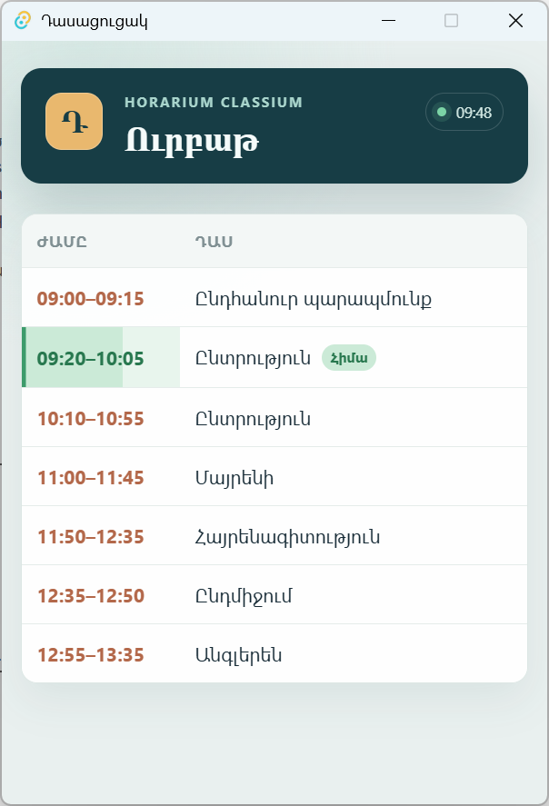

# Դասացուցակ — Horarium Classium

Windows, macOS և Linux (Ubuntu/Xubuntu family) հարթակների փոքր desktop utility՝ օրվա դասերը տեսնելու և դասերի մեկնարկից ու ավարտից տեղեկանալու համար։ Հավելվածը կառուցված է TypeScript + Vanilla HTML/CSS, Tauri 2 և Rust տեխնոլոգիաներով։ Դասացուցակը բեռնվում է frontend-ում, իսկ հիշեցումների scheduler-ը աշխատում է Rust-ում՝ անկախ թաքնված պատուհանի timer-ից։

## Հնարավորություններ

- GitHub Gist-ից դասացուցակի բեռնում՝ 10 վայրկյան timeout-ով։
- Վերջին վավեր դասացուցակի offline cache՝ application data directory-ում։
- Ձեռքով թարմացում՝ միայն tray-ից։ Ձախողված refresh-ը չի ջնջում գործող դասացուցակը։
- Աղբյուրի նշում՝ առցանց, պահված տարբերակ կամ սխալ։ Առցանց բեռնման դեպքում երևում է թարմացման ժամը։
- Ընթացիկ/հաջորդ դասի ամփոփում, ընթացող դասի առաջընթաց և «Այսօր դասեր չկան» վիճակ։
- Native system notification-ներ դասից մեկ րոպե առաջ և ավարտից հետո։
- Անջատվող bundled զանգ և optional հայերեն/անգլերեն text-to-speech։
- Պահպանվող կարգավորումներ, OS autostart և թաքնված մեկնարկ tray-ում։
- Փակման կոճակը թաքցնում է պատուհանը․ ծրագիրը ամբողջությամբ փակվում է tray-ի «Ելք» գործողությամբ։



Պատկերը նախնական UI-ն է․ ներկայիս տարբերակում ավելացված է ամփոփումը, իսկ թարմացումն ու կարգավորումները հասանելի են tray-ից։

## Տվյալներ և validation

Աղբյուրը սահմանված է `apps/student/src/schedule.ts`-ում՝ հրապարակված GitHub Gist-ի URL-ով։ Գործարկման ժամանակ նախ բեռնվում է հեռակա տարբերակը, հետո ստուգվում է, օգտագործվում և պահվում cache-ում։ Network/HTTP/JSON/validation սխալի դեպքում օգտագործվում է կրկին ստուգված cache-ը։ Եթե այն նույնպես անհասանելի կամ անվավեր է, UI-ն ցույց է տալիս սխալ և կրկին փորձելու հնարավորություն։ Cache-ի պահպանման սխալը չի խանգարում արդեն բեռնված վավեր տվյալների օգտագործմանը և ցուցադրվում է UI-ում։

Թույլատրվում են միայն `Երկուշաբթի`, `Երեքշաբթի`, `Չորեքշաբթի`, `Հինգշաբթի`, `Ուրբաթ`, `Շաբաթ`, `Կիրակի` բանալիները։ Յուրաքանչյուր դաս պետք է ունենա `start`, `end`, `lesson` տեքստային դաշտերը։ Ժամերը պետք է լինեն ճշգրիտ `HH:MM` (`00:00`–`23:59`), `start < end`, իսկ անվանումը՝ ոչ դատարկ։ Նույն օրվա դասերը չեն կարող համընկնել․ հաջորդ դասը կարող է սկսվել նախորդի ավարտի պահին։ Վավեր դասերը դասավորվում են ըստ մեկնարկի, անվանումների եզրային բացատները հեռացվում են։ Բացակայող օրը կամ դատարկ զանգվածը ազատ օր է։

Պահպանման ֆայլերը գտնվում են Tauri-ի `app_data_dir()`-ով որոշվող հավելվածի պանակում։ Այդ API-ն ընտրում է համապատասխան տեղը յուրաքանչյուր OS-ում․ կոդում hard-coded OS path չկա։

- `schedule-v1.json`՝ վերջին վավեր դասացուցակը,
- `settings.json`՝ կարգավորումները։

Գրառումը կատարվում է ժամանակավոր ֆայլի միջոցով և վերջում փոխարինում է նախորդ ֆայլը։ `localStorage` չի օգտագործվում։ Նախկին փորձնական localStorage cache-ը չի տեղափոխվում․ այս տարբերակի առաջին գործարկմանը անհրաժեշտ է առնվազն մեկ հաջող առցանց բեռնում կամ վավեր cache ֆայլ։

## Կարգավորումներ և tray

| Կարգավորում | Լռելյայն | Վարք |
| --- | --- | --- |
| Ծանուցումներ | Միացված | Գլխավոր անջատիչ՝ հիշեցումների, զանգի և խոսքի համար |
| Ձայն | Միացված | «Կաքավիկ»-ի առաջին 6 նոտաներով զանգ հիշեցումների ժամանակ |
| Խոսք | Անջատված | Հիշեցման հայերեն տեքստի արտասանում |

Մուտք գործելիս գործարկումն ու tray-ում թաքնված մեկնարկը մշտական վարք են։ Յուրաքանչյուր մեկնարկին Tauri autostart plugin-ը միացնում է OS գրանցումը։ Հին `autostartEnabled`/`startMinimized` արժեքներն անտեսվում են։ Գրանցման ձախողումը գրվում է log-ում՝ առանց հավելվածի գործարկումն ընդհատելու։ Tray-ի ստեղծման ձախողման դեպքում պատուհանը ցուցադրվում է։ Վնասված settings ֆայլի դեպքում կիրառվում են defaults-ը, սխալը գրանցվում է log-ում։

Tray-ի ընտրացանկը՝ «Բացել», «Թարմացնել դասացուցակը», նշվող «Ծանուցումներ», «Ձայն», «Խոսք» և «Ելք»։ Կարգավորումների դիալոգ չկա։ Փոփոխություններն անմիջապես պահվում են ֆայլում։ Պահպանման սխալը ցուցադրվում է գլխավոր պատուհանում, իսկ ընտրացանկի նշումները վերադառնում են պահպանված վիճակին։

## Ձայն և խոսք

Զանգը Կոմիտասի «Կաքավիկ»-ի առաջին 6 նոտաների ինքնուրույն սինթեզված, 2 վայրկյանանոց տարբերակն է՝ մեղմ զանգակային տեմբրով (mono, 16-bit PCM, 22050 Hz)։ Այն ներառված է հավելվածում որպես `src-tauri/assets/bell.wav` և բոլոր երեք հարթակներում նվագարկվում է նույն Rust backend-ից։ Օգտագործվում է [Rodio-ի միայն playback հնարավորությունը](https://docs.rs/rodio/0.21.1/rodio/#optional-features)՝ `default-features = false`․ codec փաթեթներ չեն ավելացվում, քանի որ bundled ֆայլը հայտնի PCM ձևաչափով է։ Այս փոքր native audio կախվածությունը պահպանում է թաքնված պատուհանում նվագարկումը՝ առանց browser autoplay-ից կամ արտաքին player-ից կախված լինելու։ OS տարբերությունները կառավարում է audio backend-ը․ հավելվածում WinMM/afplay առանձին implementations չկան։

Միաժամանակյա ազդանշանները չեն կուտակվում։ Ձայնային սարքի սխալը չի կանգնեցնում scheduler-ը, իսկ stalled playback-ը սահմանափակված է 5 վայրկյանով։ WAV-ը կարելի է վերաստեղծել `python3 scripts/generate-bell.py` հրամանով։ Linux build-ի համար ավելացվում է `libasound2-dev`, իսկ `.deb`/`.rpm` փաթեթներում նշված է ALSA runtime կախվածությունը։

Խոսքն օգտագործում է WebView-ի `speechSynthesis`-ը՝ նախընտրելով `hy` / `hy-AM` ձայնը։ Հայերենի բացակայության դեպքում ընտրվում է անգլերեն ձայն (`en-US`, ապա `en-GB`, ապա այլ `en`) և անգլերեն հաղորդագրություն՝ առանց հայերեն դասանունների։ Համապատասխան ձայնի կամ API-ի բացակայության դեպքում խոսքը բաց է թողնվում՝ չխանգարելով ծանուցմանը և զանգին։ Ուշ բեռնվող ձայները ստուգվում են նաև `voiceschanged`-ով՝ մինչև 5 վայրկյան. նոր հաղորդագրությունը կամ խոսքի անջատումը չեղարկում է սպասող խոսքը։ Խոսքն ու զանգը առանձին ընտրանքներ են, իսկ «Ծանուցումներ»-ի անջատիչը անջատում է երկուսն էլ։

## Scheduler-ի վարք

Rust worker-ը ստուգում է տեղային ժամը յուրաքանչյուր 10 վայրկյանը մեկ։ Դասից մեկ րոպե առաջ ուղարկվում է մեկնարկի հիշեցում։ Դասի ընթացքում մեկնարկելու կամ sleep-ից արթնանալու դեպքում կարելի է մեկ անգամ ստանալ «դասն արդեն սկսվել է» հաղորդագրությունը։ Բաց թողնված ավարտները մշակվում են վերջին ստուգված օրվա և ընթացիկ օրվա համար, ներառյալ կեսգիշերով անցումը։ Բազմօրյա sleep-ից հետո միջանկյալ ամբողջ օրերի հին հիշեցումները չեն վերարտադրվում։

Duplicate protection-ը գործում է ընթացիկ գործընթացի ընթացքում։ Օրվա փոփոխության ժամանակ նախորդ օրվա բանալիները հեռացվում են․ պահպանվում է հաջորդ օրվա `00:00` դասի արդեն տրված նախազգուշացումը։ Ծանուցումները անջատած ժամանակ իրադարձությունները նույնպես համարվում են մշակված՝ կրկին միացնելիս հին հիշեցումները չկուտակելու համար։

## Կառուցվածք

```text
apps/student/
  index.html
  src/
    main.ts             # UI, refresh, օրափոխություն
    schedule.ts         # Gist, validation, cache commands
    summary.ts          # ընթացիկ/հաջորդ դասի հաշվարկ
    settings.ts         # settings state և backend commands
    tray.ts             # tray-ից եկող frontend events
    audio.ts            # playBell() → Rust
    speech.ts           # optional speechSynthesis
    notifications.ts    # ձեռքով ծանուցման helper
    style.css
  src-tauri/
    src/
      lib.rs            # bootstrap, startup visibility
      model.rs          # դասացուցակի տիպեր
      scheduler.rs      # pure scheduler logic և worker
      storage.rs        # app-data JSON cache
      settings.rs       # settings persistence
      tray.rs           # native tray և checked items
      audio.rs          # ընդհանուր native audio backend
    assets/bell.wav
  scripts/generate-bell.py
  tests/                # Node unit tests TypeScript logic-ի համար
```

## Development և build

Անհրաժեշտ են Node.js 22.17+ (կամ համատեղելի ավելի նոր տարբերակ), npm, Rust stable և տվյալ OS-ի [Tauri prerequisites-ը](https://v2.tauri.app/start/prerequisites/)։ Windows-ում՝ C++ Build Tools/Windows SDK/WebView2, macOS-ում՝ Xcode Command Line Tools։ Ubuntu/Xubuntu-ի համար՝

```sh
sudo apt-get update
sudo apt-get install -y build-essential pkg-config libwebkit2gtk-4.1-dev libxdo-dev libssl-dev libayatana-appindicator3-dev librsvg2-dev libasound2-dev patchelf
```

Linux-ի լայն համատեղելիության համար build արեք աջակցվող ամենահին բազայի վրա․ Ubuntu/Xubuntu build-ը ստուգեք ձեռքով։ Ավելի նոր համակարգում build-ը կարող է պահանջել ավելի նոր glibc, ինչպես նկարագրված է [Tauri-ի Debian ուղեցույցում](https://v2.tauri.app/distribute/debian/#limitations)։

Հրամանները՝ `apps/student` պանակից․

```powershell
npm install
npm run tauri dev
```

Միայն `npm run dev`-ը frontend preview է․ native cache/settings/tray/audio գործողությունների համար պետք է Tauri shell-ը։

```powershell
npm test
npm run build
cargo test --manifest-path src-tauri/Cargo.toml --lib
cargo check --manifest-path src-tauri/Cargo.toml
npm run tauri build
```

Փաթեթավորումը կատարվում է համապատասխան native OS-ի վրա․ `bundle.targets`-ը մնում է `all`։ Կոնկրետ ձևաչափերի ընտրություն՝

| OS | Հրաման | Փաթեթներ |
| --- | --- | --- |
| Windows | `npm run tauri build -- --bundles msi,nsis` | MSI, NSIS |
| macOS | `npm run tauri build -- --bundles app,dmg` | `.app`, `.dmg` |
| Ubuntu/Xubuntu | `npm run tauri build -- --bundles deb,appimage` | `.deb`, `.AppImage` |

Արդյունքները՝ `apps/student/src-tauri/target/release/bundle/`։ Սովորական branch push-երի և pull request-ների համար GitHub Actions չի գործարկվում։ macOS/Linux build-երը կատարվում են ձեռքով համապատասխան միջավայրերում։

### Windows release

Պաշտոնական Windows ռելիզ ստեղծելու համար՝

1. `apps/student/package.json` և `apps/student/src-tauri/tauri.conf.json` ֆայլերում սահմանել նույն `x.y.z` տարբերակը։
2. Փոփոխությունները միացնել հիմնական branch-ին։
3. Ստեղծել և ուղարկել նույն տարբերակի tag-ը, օրինակ՝ `git tag v0.1.0`, ապա `git push origin v0.1.0`։

[`Windows release`](.github/workflows/release.yml) workflow-ը գործարկվում է միայն `vX.Y.Z` tag-ի push-ից։ Այն ստուգում է tag-ի և երկու config-ների տարբերակների համընկնումը, անցկացնում է ավտոմատ ստուգումները, կառուցում NSIS `-setup.exe` installer և ստեղծում GitHub Release՝ ավտոմատ release notes-ով։ NSIS-ը բացահայտ կարգավորված է `currentUser` ռեժիմով․ հավելվածը տեղադրվում է տվյալ օգտատիրոջ `%LOCALAPPDATA%` պանակում և administrator իրավունք չի պահանջում։ MSI չի կառուցվում և սովորական push-ից workflow չի գործարկվում։

### GitHub Release

Պաշտոնական Windows ռելիզ ստեղծելու համար՝

1. `apps/student/package.json` և `apps/student/src-tauri/tauri.conf.json` ֆայլերում սահմանել նույն `x.y.z` տարբերակը։
2. Փոփոխությունները միացնել `master`-ին։
3. Ստեղծել և ուղարկել նույն տարբերակի `vX.Y.Z` tag-ը, օրինակ՝ `git tag v0.1.0`, ապա `git push origin v0.1.0`։

[`Windows release`](.github/workflows/release.yml) workflow-ը ստուգում է tag-ի և երկու config-ների տարբերակների համընկնումը, անցկացնում է ավտոմատ ստուգումները, կառուցում MSI-ն և ստեղծում GitHub Release՝ ավտոմատ release notes-ով։ Չհամընկնող տարբերակների դեպքում հրապարակումը կանգնում է մինչև installer-ի կառուցումը։ Միևնույն tag-ի երկու զուգահեռ գործարկում չի չեղարկում արդեն սկսված ռելիզը։ Ներկայում GitHub Release-ին կցվում է միայն Windows MSI-ն. macOS/Linux փաթեթների հրապարակումը դեռ առանձին աշխատանք է։

## Հարթակների վարք և զարգացման կանոն

Նոր փոփոխությունները պետք է պահպանեն Windows/macOS/Linux աջակցությունը։ Օգտագործեք Tauri-ի cross-platform API-ները, platform-neutral անվանումները և application-data/config path resolver-ները։ Անհրաժեշտ OS տարբերությունները պահեք փոքր adapter-ներում։ Այդ կանոնները ամրագրված են նաև [apps/student/AGENTS.md](apps/student/AGENTS.md)-ում։

- **Tray․** օգտագործվում է Tauri-ի ընդհանուր menu API-ն։ Linux-ում գործողությունները հասանելի են menu-ի միջոցով․ raw tray click events-ի վրա հենվել պետք չէ ([Tauri tray docs](https://v2.tauri.app/learn/system-tray/#listen-to-tray-events))։ Desktop panel-ը պետք է ցուցադրի AppIndicator/StatusNotifier icon-երը։ Tray-ի ստեղծման սխալի դեպքում պատուհանը մնում է տեսանելի, իսկ Close-ը կարող է փակել ծրագիրը։ OS API-ն չի երաշխավորում, որ հաջող ստեղծված icon-ը իսկապես երևում է panel-ում․ tray-ի հասանելիությունը ստուգեք տվյալ desktop session-ում։
- **macOS․** Dock-ի reopen իրադարձությունը վերադարձնում է պատուհանը։ Menu bar-ի tray-ը շարունակում է աշխատել։
- **Launch at login․** բոլոր OS-երում օգտագործվում է առկա Tauri autostart plugin-ը․ macOS-ում ընտրված է LaunchAgent-ը։ Գրանցումը միացվում է յուրաքանչյուր startup-ին։ Linux AppImage-ի դեպքում այն պահեք կայուն տեղում՝ login entry-ի հղումը պահպանելու համար։
- **Native system notification․** օգտագործվում է նույն Tauri plugin-ը։ Թույլտվությունները և Do Not Disturb/Focus-ը կառավարում է տվյալ OS-ը։
- **Speech․** Windows WebView2-ը, macOS WKWebView-ը և Linux WebKitGTK-ն կարող են ունենալ տարբեր speech/voice աջակցություն։ API-ի կամ հայերեն և անգլերեն voice-երի բացակայությունը մշակվում է որպես optional feature-ի անհասանելիություն։

Յուրաքանչյուր հարթակի ձեռքով ստուգման ցանկը և փաստացի արդյունքները՝ [TESTING.md](TESTING.md)։

## Հավելվածի icon-երը

Գիրք և ժամացույց նշանի աղբյուրը՝ `apps/student/src/assets/horarium.svg`։ Նույն նշանն օգտագործվում է պատուհանի վերնամասում և favicon-ում։ Desktop PNG/ICO/ICNS ու Windows Store չափերը վերարտադրելու համար `apps/student` պանակից գործարկեք `npm run icons`։ Օգտագործվում է նախագծի առկա Tauri CLI-ն՝ առանց նոր dependency-ի։

Tray-ի համար կան առանձին պարզեցված SVG-ներ․ `tray-template.svg`-ը macOS-ի թափանցիկ template-ն է՝ համակարգի tint-ով, իսկ `tray.svg`-ը Windows/Linux-ի հակադրությամբ տարբերակն է։ Դրանք նույնպես գեներացվում են նույն հրամանով։

## Սահմանափակումներ

- Յուրաքանչյուր OS-ի notification/tray/audio/launch-at-login վարքը և native installer-ը պետք է ստուգվեն այդ OS-ում։ Մի հարթակի build-ը մյուս երկուսի հաստատումը չէ։
- OS-ի volume/notification կարգավորումները կարող են լռեցնել ազդանշանները։
- Հայերեն խոսքը կախված է տեղադրված voice-երից և WebView-ի աջակցությունից, հատկապես թաքնված պատուհանի դեպքում։
- Հիշեցումների duplicate state-ը չի պահպանվում restart-երի միջև․ դասի ընթացքում նոր գործարկումը կարող է նորից տալ «արդեն սկսվել է» հիշեցումը։
- Դասացուցակը թարմացվում է գործարկման և ձեռքով refresh-ի ժամանակ, ոչ պարբերաբար։ Cache-ը կարող է հնացած լինել․ UI-ն նշում է դրա օգտագործումը։
